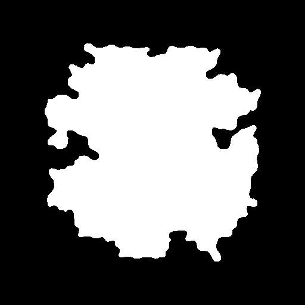
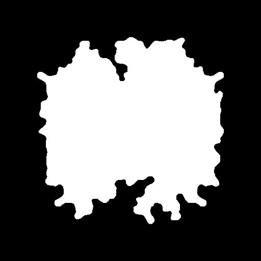
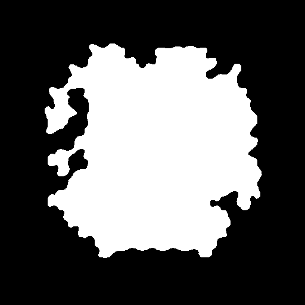
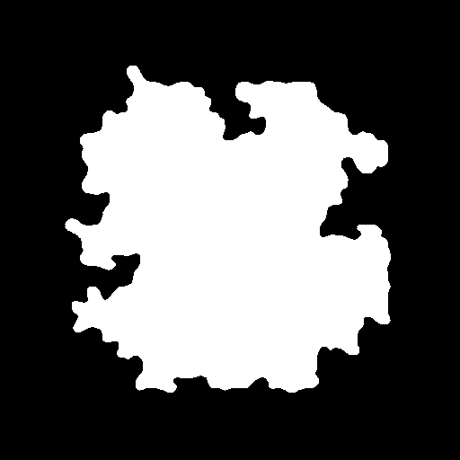
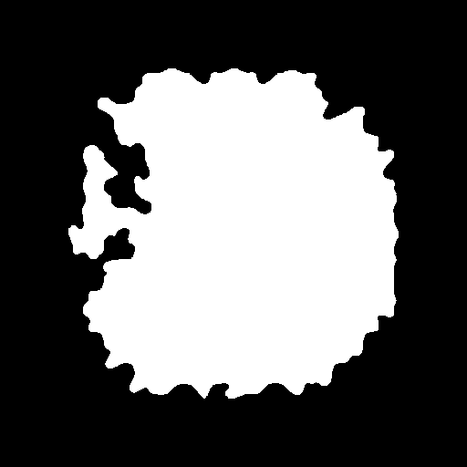
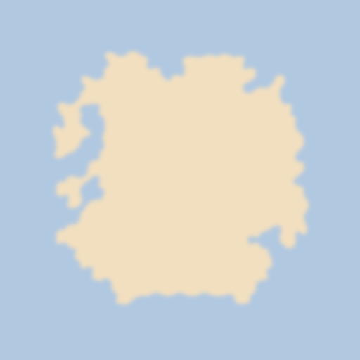
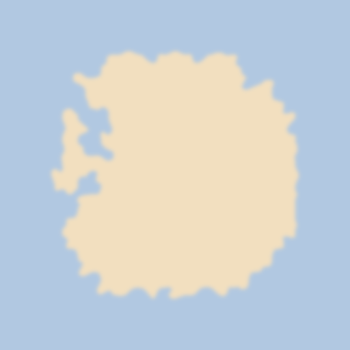

# Multi-threaded Wave Function Collapse for island generation

Examples:

  
   
  
  
  

  
   
  
  
  

# Features:
- parallelized workers for tile selection and propagation
- backtracking
- island shaped output
- remove holes from island
- tile rotation, inversion and flipping
- tile weighting based on edge type
- automatic tile compatibility detection
- manually drawn tiles

## Other possible tiles
- tiles with 3 corners (Y shape) + 2 corners same side to connect these